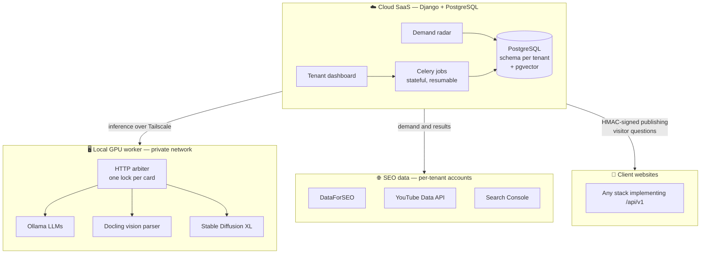

# 🤖 PubliBot: AI-Driven SEO Content Orchestrator

[](https://www.python.org/downloads/)
[](https://www.djangoproject.com/)
[](https://docs.celeryq.dev/)
[](https://github.com/pgvector/pgvector)
[](https://ollama.com/)

> **A multi-tenant SaaS that finds what people are actually searching for, grounds every claim in curated real sources, and publishes SEO content only after a human approves it — then measures the result in Google Search Console.**

## 🎯 The Problem It Solves

Most AI content generators produce generic, hallucinated text that search engines increasingly penalize (Google's E-E-A-T guidelines). Grounding the model with real documents (RAG) runs into three practical walls:

* **Parsing:** standard PDF extractors scramble dual-column scientific layouts.
* **Coherence:** injecting random chunks into a prompt causes the **"Frankenstein Effect"** — paragraphs that contradict each other.
* **Direction:** even a well-grounded article is wasted if nobody searches for its topic, and most tools never check whether it ranked.

## 💡 The PubliBot Solution

PubliBot closes the whole loop — **demand → sources → writing → human review → publishing → measurement** — with each step designed against a specific way AI content goes wrong:

1. **Demand Radar (no LLM involved):** collects signals from Google's "People Also Ask", related searches, real search volume, visitor questions, YouTube comments, competitors' sitemaps and rankings, and Search Console's "almost there" queries. Signals are clustered by embeddings and scored with an explainable breakdown (demand, source diversity, business fit, cannibalization, source coverage). Topics arrive as *suggestions*, with the evidence attached.
2. **Vision-Based Ingestion:** PDFs are converted by a layout-aware vision model (`Docling`) on a local GPU, so dual-column papers become clean, structured Markdown. Office files, web pages, YouTube transcripts and expert notes are first-class sources too.
3. **Curated Summary Indexing:** a human selects the high-value passages (abstracts, conclusions); only those are embedded, one vector per paragraph. Each source category carries a profile: how to cite it, whether it can back the article's central claim, and when it expires.
4. **Anti-Frankenstein Thesis:** before drafting, the model reads the retrieved passages and builds a single "consensus thesis", explicitly recording where sources disagree. The article is written from that thesis, with citations that point back to real, verifiable sources.
5. **Human-in-the-Loop, enforced:** nothing is published without approval by an identified author. An editorial guide checks tone, forbidden terms and telltale AI phrasing before approval.
6. **Closed Feedback Loop:** Google Search Console shows impressions, clicks and position for every published article, and feeds new opportunities back into the radar.

## 🏗️ System Architecture



* **The cloud never runs heavy models.** It talks HTTP to inference endpoints — a local GPU over Tailscale, or any OpenAI-compatible API — each with its own concurrency limit. Swapping providers is a row in the admin panel, not a deploy (no LangChain, no CrewAI).
* **The database is the source of truth, not the broker.** Every generation is a stateful job; if the GPU goes offline mid-article, the job pauses and resumes from the exact step when the card is back.
* **Client sites are plain HTTP.** Any platform that implements the documented `/api/v1` contract (HMAC-signed, replay-protected requests) can receive content. A Django reference implementation passes the contract test suite.

## ✨ Core Engineering Features

* **Real multi-tenancy:** one PostgreSQL schema per tenant (`django-tenants`), a subdomain per tenant, and uploaded files stored per schema.
* **Hybrid retrieval:** HNSW vector search (`multilingual-e5-large`, on CPU via ONNX) fused with PostgreSQL full-text search by Reciprocal Rank Fusion, with an optional cross-encoder reranker and per-tenant relevance thresholds.
* **The web as a supplier, not an author:** when the library can't support a topic, PubliBot proposes candidate pages and videos — they still go through human curation. Trust is granted per *path*, not per domain, in two levels (prefer in search / auto-approve), because user-generated areas live on reputable domains too.
* **Competitor gap analysis:** competitors' public sitemaps (free), the keywords they rank for, and complaints in their Google reviews become demand signals; the cannibalization score removes what the site already covers, leaving the real content gap.
* **Cost ledger with hard caps:** every external call — paid or free, success or failure — is recorded with the cost the provider reported. Monthly caps are checked *before* each call, per tenant and per installation. Batch rounds use DataForSEO's standard queue (about a third of the live price); only interactive searches pay for live results.
* **Human-picked cover images:** Stable Diffusion XL generates covers in batches of three on the local GPU; a person chooses, and earlier batches are never discarded.
* **FAQ as structured data:** questions and answers travel as a separate contract field, so each site renders them — and their schema markup — its own way.
* **Q&A from real visitors:** questions submitted on client sites are pulled, answered from the same curated library, and reviewed before publishing.
* **Idempotent ingestion:** files are deduplicated by SHA-256 at upload time, papers by DOI.
* **Per-tenant publishing cadence:** independent schedules (crawl-budget friendly), with idempotency keys and reconciliation after timeouts, so a retry never publishes twice.

## 🛠️ Tech Stack

| Layer | Technology |
|---|---|
| Application | Python 3.12, Django 5.2 LTS, django-tenants |
| Async engine | Celery 5.6, Redis, django-celery-beat |
| Database | PostgreSQL + `pgvector` (HNSW, cosine distance) |
| Embeddings | `intfloat/multilingual-e5-large` via fastembed (ONNX, CPU) |
| Inference | Ollama and any OpenAI-compatible API; Anthropic supported |
| Documents | Docling (GPU), python-docx, python-pptx, openpyxl, trafilatura |
| Images | Stable Diffusion XL on the local GPU worker |
| SEO data | DataForSEO, YouTube Data API v3, Google Search Console |
| Infrastructure | Nginx, Gunicorn, systemd, Tailscale |

## 🚀 Getting Started

**1. Clone and install** (requires PostgreSQL with `pgvector`, and Redis):

```bash
git clone https://github.com/EduardoReolon/publi-bot.git
cd publi-bot
python3.12 -m venv venv
source venv/bin/activate
pip install -r requirements.txt -r requirements-dev.txt
cp .env.example .env        # set DJANGO_SECRET_KEY and POSTGRES_PASSWORD
./scripts/setup-db.sh
```

**2. Migrate and run.** `dev` starts the web server, the Celery worker and the beat scheduler together:

```bash
python manage.py migrate_schemas --shared
python manage.py bootstrap_public
python manage.py createsuperuser
python manage.py dev
```

Open `http://publibot.localhost:8000/`. Each tenant lives on its own subdomain (`http://acme.publibot.localhost:8000/`).

**3. Connect an LLM:**

```bash
python manage.py configurar_inferencia --testar
```

The full guide — development, production server, GPU machine and troubleshooting — is in [`docs/OPERACAO.md`](docs/OPERACAO.md). External accounts (DataForSEO, YouTube, Search Console) are covered step by step in [`docs/CONTAS_EXTERNAS.md`](docs/CONTAS_EXTERNAS.md).

## 📂 Project Structure

```
apps/
  accounts/      tenants, users, memberships            (public schema)
  inference/     inference connections, capacity        (public schema)
  knowledge/     documents, web sources, curation, RAG  (per tenant)
  content/       prompts, topics, articles, FAQ, Q&A    (per tenant)
  editorial/     editorial guide, forbidden terms       (per tenant)
  radar/         demand, competitors, Search Console    (per tenant)
  integrations/  client sites, /api/v1 client, cadence  (per tenant)
  ops/           stateful jobs, health probes           (per tenant)
core/            settings, routing, Celery app
deploy/          Nginx, systemd units, deploy and backup scripts
docs/
  adr/           architecture decision records
  contrato/      the /api/v1 contract, OpenAPI spec and reference node
tests/           main suite (~850 tests)
tests_contrato/  end-to-end contract tests
```

The GPU worker lives in its own repository.

## 📚 Documentation

The in-depth documentation is written in Portuguese.

* [`docs/adr/`](docs/adr/) — every architectural decision, with its reasoning and consequences.
* [`docs/ARMADILHAS.md`](docs/ARMADILHAS.md) — real failures, their literal symptoms, and where each one is handled.
* [`docs/contrato/`](docs/contrato/) — what a website must implement to receive content.
* [`docs/EXTRACAO.md`](docs/EXTRACAO.md) — PDF extraction heuristics and how to calibrate them.
* [`docs/BLOCOS.md`](docs/BLOCOS.md) — packing each capability into a self-contained file for small-context AI assistants.

## 📄 License

No license is granted; all rights reserved. See [`NOTICE.md`](NOTICE.md).

---

*Conceptualized and built as an exploration of scalable AI workflows, SEO engineering, and decoupled machine learning architectures.*
